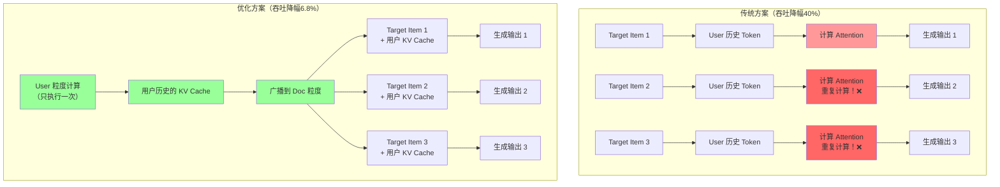
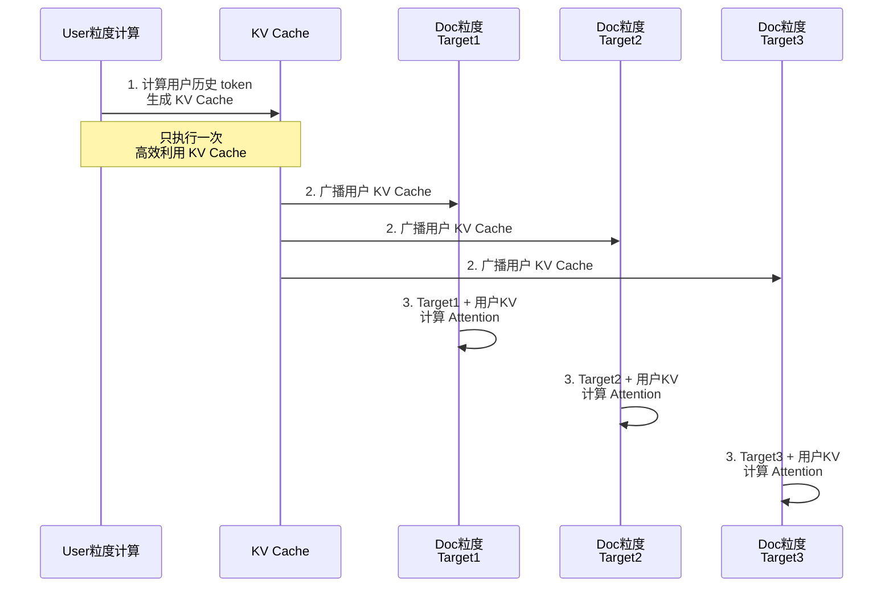
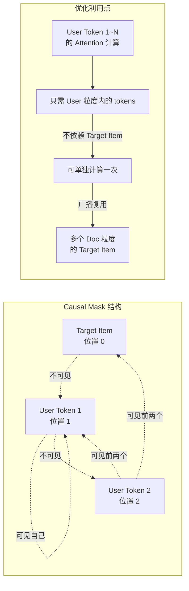

# KV Cache 优化方案示意图

## 场景描述
在推荐系统中，输入序列结构如下：
- 第一个位置：Target Item（目标商品）
- 后续位置：User粒度的历史数据
- 由于 Causal Mask，后面的 token 看不到前面的 token

## 优化核心思路
1. 在 User 粒度计算后续 token 的 KV Cache（不依赖 Target Item）
2. 将计算结果广播到 Doc 粒度（每个候选商品）
3. 避免重复计算，提升吞吐

## 推理流程对比

## 详细流程图

## 注意力计算细节

## 性能提升数据

| 指标 | 传统方案 | 优化方案 | 改进 |
|------|--------|--------|------|
| **推理吞吐降幅** | 40% | 6.8% | ↓33.2% |
| **序列增长时** | 线性恶化 | 几乎无影响 | ⬆️ 显著 |
| **显存压力** | 每个 Doc 独立 | 共享 KV Cache | 减少 N 倍 |

## 关键优化点总结

1. ✅ **识别独立计算空间**：User 粒度的 token 计算彼此独立
2. ✅ **减少冗余计算**：多个 Target Item 不重复计算用户历史
3. ✅ **KV Cache 复用**：一份 User KV Cache，广播给所有 Doc
4. ✅ **显存优化**：避免 N 份相同的 KV Cache 存储
