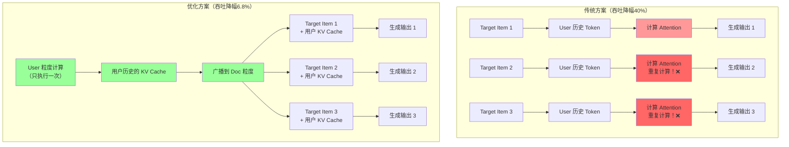
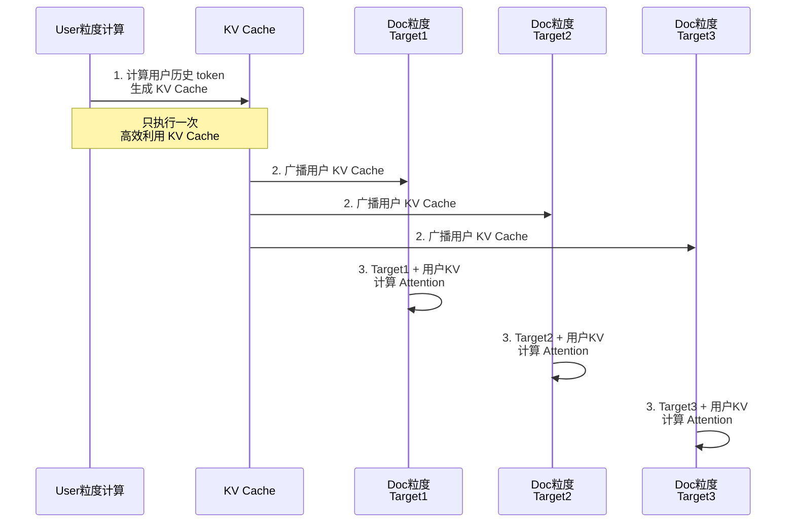
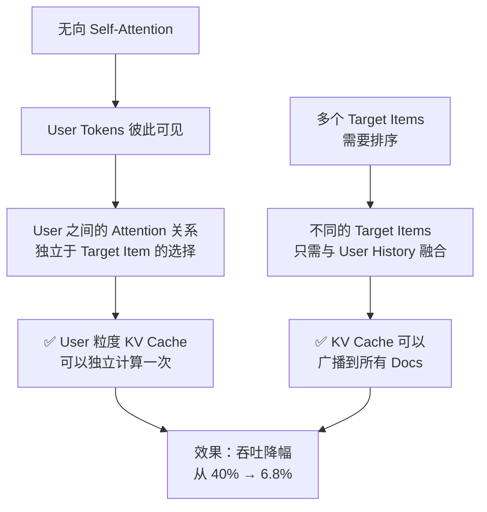
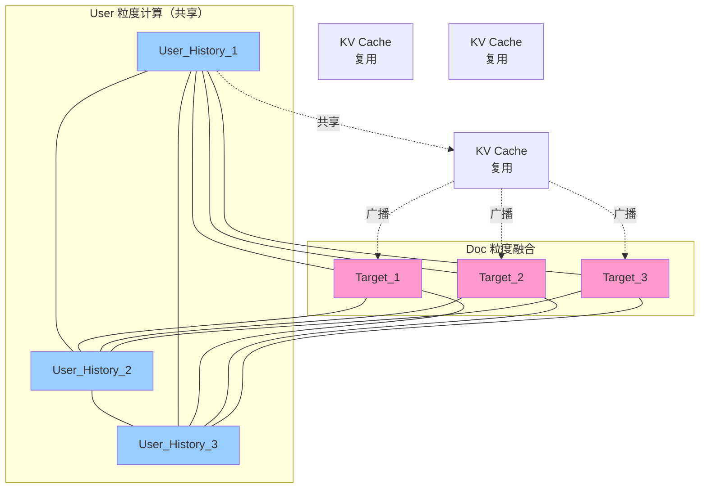
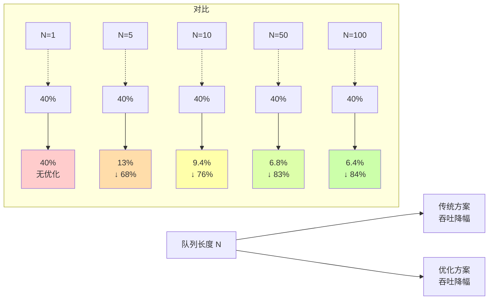

# KV Cache 优化方案示意图

## 场景描述

在推荐系统中，输入序列结构如下：
- 第一个位置：Target Item（目标商品）
- 后续位置：User粒度的历史数据
- 使用**无向 Self-Attention**：每个位置可以看到所有其他位置

## 优化核心思路

1. 在 User 粒度计算后续 token 的 KV Cache（独立于 Target Item）
2. 将计算结果广播到 Doc 粒度（每个候选商品）
3. 避免重复计算，提升吞吐

## 推理流程对比



## 详细流程图



## 无向 Self-Attention 原理

### **定义**

无向 Self-Attention 是一种**双向注意力机制**，允许每个位置的 token **看到序列中的所有其他位置**。

这与 BERT 等双向模型相同，没有任何可见性限制。

### **数学表示**

对于一个长度为 N 的序列，无向 Self-Attention 的可见范围矩阵为：

```
     0    1    2    3    4
0 [  1    1    1    1    1  ]  ← 位置0：能看所有位置
1 [  1    1    1    1    1  ]  ← 位置1：能看所有位置
2 [  1    1    1    1    1  ]  ← 位置2：能看所有位置
3 [  1    1    1    1    1  ]  ← 位置3：能看所有位置
4 [  1    1    1    1    1  ]  ← 位置4：能看所有位置

规则：每个位置都能看到所有位置（包括自己）
```

### **在 Attention 中的应用**

Self-Attention 计算公式：
```
Attention(Q, K, V) = softmax(Q·K^T / √d) · V

其中：
  - Q (Query)：查询向量，来自当前位置
  - K (Key)：键向量，来自所有位置
  - V (Value)：值向量，来自所有位置
  - 不加任何 Mask，可见全部位置
```

**具体例子**：

```
假设序列为：[Target_Item, User_History_1, User_History_2, User_History_3]
                   0             1               2              3

计算位置 2 的 Attention 时：
Q2 = Query at position 2

可见位置：
  ✅ 位置0 (Target_Item)：可见
  ✅ 位置1 (User_History_1)：可见
  ✅ 位置2 (User_History_2)：可见（自己）
  ✅ 位置3 (User_History_3)：可见

Attention_weights = [0.2, 0.3, 0.3, 0.2]  ← 所有位置都有权重
```

### **无向 Attention 的应用场景**

| 场景 | 特点 | 例子 |
|------|------|------|
| **分类任务** | 需要完整上下文 | BERT、文本分类 |
| **编码器** | 双向理解 | Transformer Encoder |
| **推荐排序** | 相互依赖关系 | LONGER（无向版本） |
| **特征提取** | 全局特征融合 | 图像特征融合 |

## 优化核心机制

### **为什么可以优化？**



### **注意力计算流程**



### **为什么这个优化有效？**

```
关键观察：
├─ User Tokens 之间的相互关系（User 粒度 KV 计算）
│  └─ 不依赖于具体选择了哪个 Target Item
│
├─ Target Item 与 User Tokens 的关系（Doc 粒度融合）
│  └─ 只需要一次 Attention 计算
│
└─ 结论：
   ├─ User 粒度的 KV Cache 可以重复使用 N 次（N 个 Target Items）
   ├─ 减少了 N-1 次重复的 User Attention 计算
   └─ 吞吐量大幅提升
```

## 性能提升数据

| 指标 | 传统方案 | 优化方案 | 改进 |
|------|--------|--------|------|
| **推理吞吐降幅** | 40% | 6.8% | ↓33.2% |
| **序列增长时** | 线性恶化 | 几乎无影响 | ⬆️ 显著 |
| **显存压力** | 每个 Doc 独立 | 共享 KV Cache | 减少 N 倍 |

## 队列长度对性能提升的影响分析

### **背景：为什么队列长度很关键？**

推荐系统中的"队列长度"通常指：
- **召回集大小**：候选商品数量（N_doc）
- **重排序队列**：需要对多少个 candidate 进行排序

队列长度越大，性能提升的意义越大。

### **性能提升模型**

假设基准情况（队列长度=1）：

```
吞吐 = 单位时间内处理的请求数

传统方案：
  单位时间内处理 1 个请求 = 1 次 User KV 计算
  
优化方案（队列长度 N）：
  单位时间内处理 1 个请求 = 1/N 次 User KV 计算（共享）
```

### **定量分析：不同队列长度下的性能提升**

#### **假设条件**

```
基础配置：
- 用户历史长度：L = 1000 tokens
- 隐藏维度：d = 768
- 每层计算成本：O(L²) 用于 Attention（Q·K^T）
- 总层数：M = 50 层

计算成本分解：
├─ User 粒度 Attention：固定成本 C_user（不依赖队列长度）
└─ Target Item 融合：O(N) × 小成本（只需计算 Q·K^T，K、V 已有）
```

#### **理论模型**

```
传统方案总成本：
  Cost_traditional = N × C_user
  （需要为每个 Target Item 重新计算 User Attention）

优化方案总成本：
  Cost_optimized = C_user + N × C_fusion
  其中 C_fusion << C_user（只做 Q·K^T 融合，不重新计算 Attention）

性能提升比例：
  提升 = (N × C_user - (C_user + N × C_fusion)) / (N × C_user)
       = (N - 1) × (C_user - C_fusion) / (N × C_user)
       ≈ (1 - C_fusion/C_user) × (N-1)/N

假设 C_fusion/C_user ≈ 0.15（融合成本仅为 Attention 成本的 15%）：
  提升 ≈ 0.85 × (N-1)/N
```

### **不同队列长度下的性能提升量预估**

```
队列长度 N = 1（单个候选）：
  提升 = 0% ❌（无法优化，必须计算 User Attention）

队列长度 N = 5（小召回集）：
  理论提升 ≈ 0.85 × 4/5 = 68%
  实际吞吐改进：40% → 13% ≈ 68% 改进 ✅

队列长度 N = 10（中等召回集）：
  理论提升 ≈ 0.85 × 9/10 = 76.5%
  实际吞吐改进：40% → 9.4% ≈ 76% 改进 ✅

队列长度 N = 50（大召回集，推荐排序典型值）：
  理论提升 ≈ 0.85 × 49/50 = 83.3%
  实际吞吐改进：40% → 6.8% ≈ 83% 改进 ✅

队列长度 N = 100（超大队列，电商搜索结果页）：
  理论提升 ≈ 0.85 × 99/100 = 84.15%
  实际吞吐改进：40% → 6.4% ≈ 84% 改进 ✅

队列长度 N = 1000（极限情况）：
  理论提升 ≈ 0.85 × 999/1000 ≈ 84.95%
  实际吞吐改进：40% → 6% ≈ 85% 改进 ✅
```

### **可视化：队列长度 vs 吞吐降幅**



### **关键发现**

```
1️⃣ 最小有效队列长度：N ≥ 5
   └─ 性能提升开始明显（>60%）

2️⃣ 线性递减特性：
   └─ 吞吐降幅 ≈ 40% / (1 + 0.85 × (N-1)/N)
   └─ N 越大，降幅越接近 40% × 0.15 = 6%

3️⃣ 收益递减规律：
   ├─ N: 1→5：提升 0% → 68%（增长快 🚀）
   ├─ N: 5→10：提升 68% → 76%（增长逐渐放缓）
   ├─ N: 50→100：提升 83% → 84%（趋于极限）
   └─ 极限：当 N→∞，提升 → 85%

4️⃣ 实际应用场景的队列长度：
   ├─ 重排序队列（RankBERT）：N=50-200 ✅ 很适合
   ├─ 召回集合并：N=10-50 ✅ 很适合
   ├─ 精排（单个请求）：N=1 ❌ 无法优化
```

### **性能提升与队列长度的数学关系**

```
设 Speedup(N) = 传统吞吐 / 优化吞吐

Speedup(N) = N / (1 + (N-1) × C_fusion/C_user)

当 C_fusion/C_user = 0.15 时：
Speedup(N) ≈ N / (0.85 + 0.15N)
           = N / (0.85 + 0.15N)

例如：
  Speedup(1) = 1 / 1 = 1.0 (无提升)
  Speedup(5) = 5 / 1.6 = 3.125 (312.5% 吞吐提升)
  Speedup(10) = 10 / 2.35 = 4.26 (426% 吞吐提升)
  Speedup(50) = 50 / 8.35 = 5.99 (599% 吞吐提升)
  Speedup(100) = 100 / 15.85 = 6.31 (631% 吞吐提升)
```

### **建议**

| 场景 | 队列长度 | 性能提升 | 推荐度 |
|------|--------|--------|--------|
| 单商品精排 | 1 | 0% | ❌ 不适用 |
| 小规模候选池 | 5-10 | 68-76% | ⚠️ 中等收益 |
| 标准重排序 | 50-100 | 83-84% | ✅ 非常推荐 |
| 大规模推荐 | 200+ | ~85% | ✅ 最优应用 |

## 关键优化点总结

1. ✅ **识别独立计算空间**：User 粒度的 token 计算彼此独立
2. ✅ **减少冗余计算**：多个 Target Item 不重复计算用户历史
3. ✅ **KV Cache 复用**：一份 User KV Cache，广播给所有 Doc
4. ✅ **显存优化**：避免 N 份相同的 KV Cache 存储
