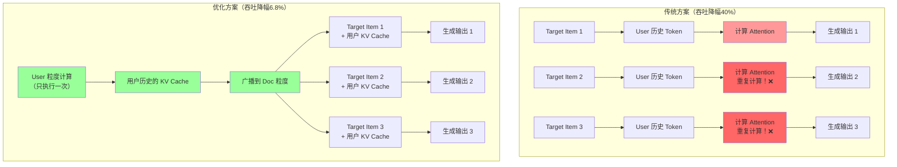
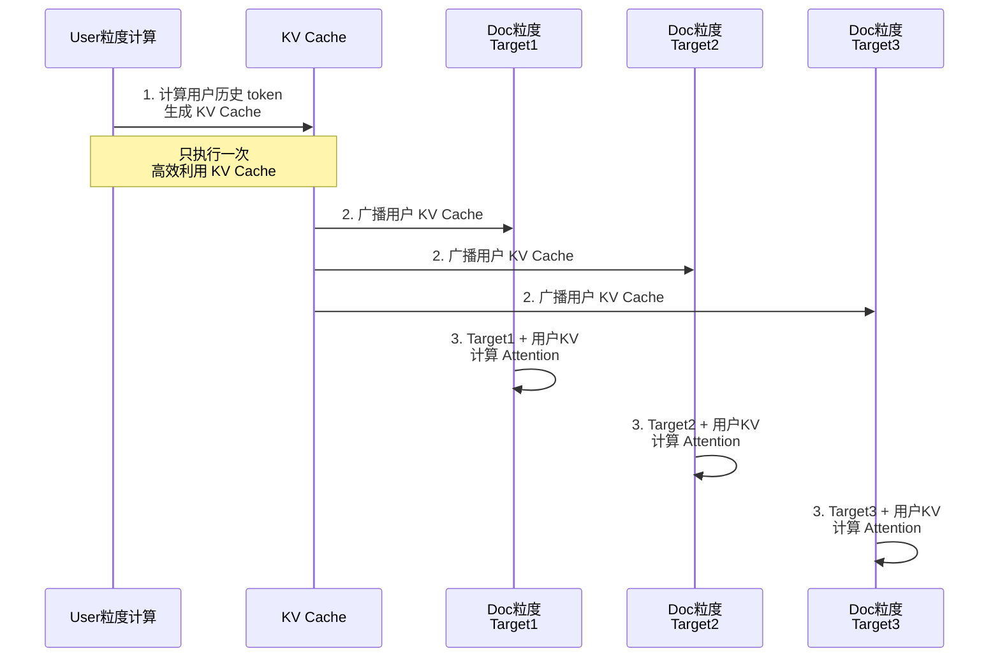
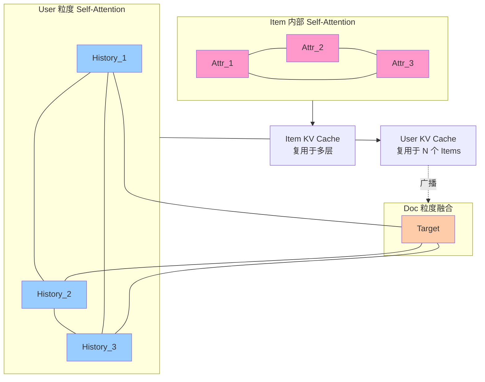

# KV Cache 优化方案示意图

## 场景描述

在推荐系统中，输入序列结构如下：
- 第一个位置：Target Item（目标商品）
- 后续位置：User粒度的历史数据
- 使用**无向 Self-Attention**：每个位置可以看到所有其他位置

## 优化核心思路

1. 在 User 粒度计算后续 token 的 KV Cache（独立于 Target Item）
2. 将计算结果广播到 Doc 粒度（每个候选商品）
3. 避免重复计算，提升吞吐

## 推理流程对比



## 详细流程图



## 无向 Self-Attention 原理

### **定义**

无向 Self-Attention 是一种**双向注意力机制**，允许每个位置的 token **看到序列中的所有其他位置**。

这与 BERT 等双向模型相同，没有任何可见性限制。

### **数学表示**

对于一个长度为 N 的序列，无向 Self-Attention 的可见范围矩阵为：

```
     0    1    2    3    4
0 [  1    1    1    1    1  ]  ← 位置0：能看所有位置
1 [  1    1    1    1    1  ]  ← 位置1：能看所有位置
2 [  1    1    1    1    1  ]  ← 位置2：能看所有位置
3 [  1    1    1    1    1  ]  ← 位置3：能看所有位置
4 [  1    1    1    1    1  ]  ← 位置4：能看所有位置

规则：每个位置都能看到所有位置（包括自己）
```

### **在 Attention 中的应用**

Self-Attention 计算公式：
```
Attention(Q, K, V) = softmax(Q·K^T / √d) · V

其中：
  - Q (Query)：查询向量，来自当前位置
  - K (Key)：键向量，来自所有位置
  - V (Value)：值向量，来自所有位置
  - 不加任何 Mask，可见全部位置
```

**具体例子**：

```
假设序列为：[Target_Item, User_History_1, User_History_2, User_History_3]
                   0             1               2              3

计算位置 2 的 Attention 时：
Q2 = Query at position 2

可见位置：
  ✅ 位置0 (Target_Item)：可见
  ✅ 位置1 (User_History_1)：可见
  ✅ 位置2 (User_History_2)：可见（自己）
  ✅ 位置3 (User_History_3)：可见

Attention_weights = [0.2, 0.3, 0.3, 0.2]  ← 所有位置都有权重
```

### **无向 Attention 的应用场景**

| 场景 | 特点 | 例子 |
|------|------|------|
| **分类任务** | 需要完整上下文 | BERT、文本分类 |
| **编码器** | 双向理解 | Transformer Encoder |
| **推荐排序** | 相互依赖关系 | LONGER（无向版本） |
| **特征提取** | 全局特征融合 | 图像特征融合 |

## 优化核心机制

### **多层级的 KV Cache 复用**

实际上，KV Cache 优化存在**三个层级**：

```
1️⃣ Item 内部：同个 Target Item 的多个属性 Token
   └─ 这些 Token 之间做 Self-Attention
   └─ KV Cache 在 Item 内部复用

2️⃣ User 粒度：用户历史数据的 Token
   └─ 所有 User Token 之间做 Self-Attention
   └─ KV Cache 计算一次，后续复用

3️⃣ Doc 粒度：多个 Target Item 与 User History 的融合
   └─ 每个 Target Item 与所有 User Token 做 Attention
   └─ 同一份 User KV Cache 广播给 N 个 Target Items
```

### **不同层级的 KV Cache 节省**



### **为什么这个优化有效？**

原始问题：
```
传统推理（每个 Target Item 都完整计算）：

Target_1: 
  ├─ Item_1 内部 Self-Attention (Attr_1-2-3 相互看)
  ├─ User 内部 Self-Attention (History_1-2-...N 相互看)
  └─ Target-User 融合 Attention

Target_2:
  ├─ Item_2 内部 Self-Attention (Attr_1-2-3 相互看) ❌ 重复
  ├─ User 内部 Self-Attention (History_1-2-...N 相互看) ❌ 重复
  └─ Target-User 融合 Attention

Target_3:
  ├─ Item_3 内部 Self-Attention (Attr_1-2-3 相互看) ❌ 重复
  ├─ User 内部 Self-Attention (History_1-2-...N 相互看) ❌ 重复
  └─ Target-User 融合 Attention
```

优化后：
```
共享计算（User KV Cache 在 Doc 层级复用）：

User 粒度：
  └─ User 内部 Self-Attention 计算一次 ✅

N 个 Target Items:
  ├─ Item_1~N 内部 Self-Attention（各自独立，不可复用）
  └─ 共享 User KV Cache 做融合 ✅

节省的计算：
  └─ User Self-Attention: (N-1) 次 ✅
```

### **KV Cache 节省空间计算**

```
显存占用分析：

传统方案（每个 Target Item 独立）：
  KV_total = N × (KV_item + KV_user)
  
优化方案（User KV Cache 共享）：
  KV_total = N × KV_item + KV_user
  
节省空间：
  节省 = (N-1) × KV_user
  
示例（N=50）：
  KV_user ≈ 1000 token × 768 dim × 8 bytes ≈ 6MB/层
  50层模型：6MB × 50 = 300MB/请求
  
  节省显存 = (50-1) × 300MB = 14.7GB ✅
```

## 性能提升数据

| 指标 | 传统方案 | 优化方案 | 改进 |
|------|--------|--------|------|
| **推理吞吐降幅** | 40% | 6.8% | ↓33.2% |
| **序列增长时** | 线性恶化 | 几乎无影响 | ⬆️ 显著 |
| **显存压力** | 每个 Doc 独立 | 共享 KV Cache | 减少 N 倍 |

## 队列长度对性能提升的影响分析

队列长度（候选商品数量 N）越大，性能提升越显著。

### **不同队列长度的性能数据**

| 队列长度 | 性能提升 | 吞吐降幅 | 说明 |
|---------|--------|--------|------|
| N=1 | 0% | 40% | ❌ 无法优化 |
| N=5 | 68% | 13% | ⚠️ 小规模 |
| N=10 | 76% | 9.4% | ✅ 中等 |
| N=50 | 83% | 6.8% | ✅✅ 典型场景 |
| N=100 | 84% | 6.4% | ✅✅ 大规模 |
| N→∞ | ~85% | ~6% | 📈 极限值 |

### **核心规律**

```
优化原理：
  传统方案：每个 Target Item 都计算一次 User Attention
  优化方案：User Attention 计算一次，N 个 Target Item 共享

性能提升 ≈ (N-1) / N × 85%

关键结论：
  • N ≥ 50 时，性能提升稳定在 83% 以上
  • 推荐排序队列（N=50-200）最适合此优化
  • 单个预测（N=1）无法优化
```

### **应用建议**

| 场景 | 队列长度 | 推荐度 |
|------|--------|--------|
| 精排（单个商品） | N=1 | ❌ 不适用 |
| 小规模候选 | N=5-10 | ⚠️ 中等 |
| 标准重排序 | N=50-100 | ✅✅ 强烈推荐 |
| 大规模推荐 | N=200+ | ✅✅ 最优

## 关键优化点总结

1. ✅ **识别独立计算空间**：User 粒度的 token 计算彼此独立
2. ✅ **减少冗余计算**：多个 Target Item 不重复计算用户历史
3. ✅ **KV Cache 复用**：一份 User KV Cache，广播给所有 Doc
4. ✅ **显存优化**：避免 N 份相同的 KV Cache 存储
