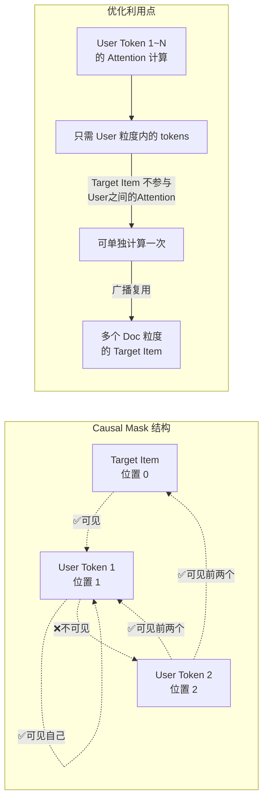
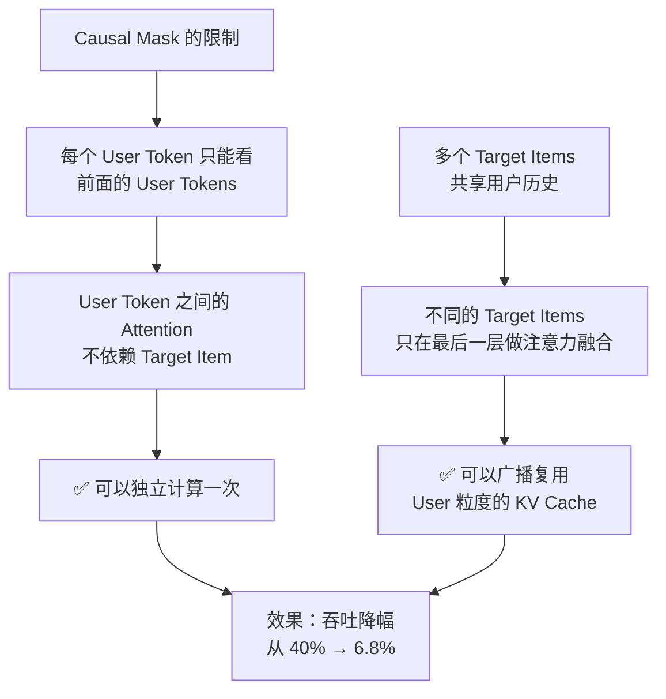

# KV Cache 优化方案示意图

## 场景描述
在推荐系统中，输入序列结构如下：
- 第一个位置：Target Item（目标商品）
- 后续位置：User粒度的历史数据
- 由于 Causal Mask，后面的 token 看不到前面的 token

## 优化核心思路
1. 在 User 粒度计算后续 token 的 KV Cache（不依赖 Target Item）
2. 将计算结果广播到 Doc 粒度（每个候选商品）
3. 避免重复计算，提升吞吐

## 推理流程对比


## 详细流程图


## 什么是 Causal Mask？

### **定义**
Causal Mask（因果掩码）是一种**注意力掩码机制**，它限制每个位置的 token **只能看到当前位置及其之前的 token**，**看不到未来的 token**。

这是为了**模拟自回归生成过程**（左到右的顺序生成），确保模型生成时不会"作弊"地看到未来信息。

### **数学表示**

对于一个长度为 N 的序列，Causal Mask 是一个 N×N 的矩阵：

```
     0    1    2    3    4
0 [  1    0    0    0    0  ]  ← 位置0：只能看自己
1 [  1    1    0    0    0  ]  ← 位置1：能看位置0、1
2 [  1    1    1    0    0  ]  ← 位置2：能看位置0、1、2
3 [  1    1    1    1    0  ]  ← 位置3：能看位置0、1、2、3
4 [  1    1    1    1    1  ]  ← 位置4：能看所有前面的位置

规则：mask[i][j] = 1 当 j ≤ i（j在i之前或相同位置）
      mask[i][j] = 0 当 j > i（j在i之后）
```

### **在 Attention 中的应用**

Self-Attention 计算公式：
```
Attention(Q, K, V) = softmax((Q·K^T / √d) + Mask) · V

其中 Mask 将不应该看到的位置设为 -∞，经过 softmax 后变为 0
```

**具体例子**：

```
假设序列为：[Target_Item, History_1, History_2, History_3]
                   0              1          2         3

计算位置2的 Attention 时：
Q2 = Query at position 2

可见位置：
  ✅ 位置0 (Target_Item)：可见
  ✅ 位置1 (History_1)：可见
  ✅ 位置2 (History_2)：可见（自己）
  ❌ 位置3 (History_3)：看不见

Attention_weights = [0.3, 0.3, 0.2, 0.0]  ← 位置3的权重被屏蔽为0
```

### **与标准 Attention 的区别**

| 类型 | 可见范围 | 用途 | 例子 |
|------|--------|------|------|
| **无 Mask** | 看到所有位置 | 双向上下文 | BERT、分类任务 |
| **Causal Mask** | 只看过去和现在 | 自回归生成 | GPT、翻译、推荐排序 |
| **Seq2Seq Mask** | Encoder 无限制、Decoder 因果 | 序列到序列 | 机器翻译 |

### **推荐系统中的 Causal Mask**

在 LONGER 中的应用场景：

```
输入序列：[Target_Item, User_Click_1, User_Click_2, ..., User_Click_N]
           位置 0          位置 1       位置 2        位置 N

Causal Mask 的含义：
├─ 位置0（Target_Item）：通常是预测目标，可以作为起点
├─ 位置1~N（User历史）：这些位置按时间顺序排列
│  
└─ Mask 规则：确保按时间顺序处理用户历史
   ✅ 位置2可以看：位置0、1、2（过去的行为）
   ❌ 位置2看不到：位置3、4...（未来的行为）
```

## 注意力计算细节



### **为什么 Causal Mask 让优化成为可能？**



## 性能提升数据

| 指标 | 传统方案 | 优化方案 | 改进 |
|------|--------|--------|------|
| **推理吞吐降幅** | 40% | 6.8% | ↓33.2% |
| **序列增长时** | 线性恶化 | 几乎无影响 | ⬆️ 显著 |
| **显存压力** | 每个 Doc 独立 | 共享 KV Cache | 减少 N 倍 |

## 队列长度对性能提升的影响分析

### **背景：为什么队列长度很关键？**

推荐系统中的"队列长度"通常指：
- **召回集大小**：候选商品数量（N_doc）
- **重排序队列**：需要对多少个 candidate 进行排序

队列长度越大，性能提升的意义越大。

### **性能提升模型**

假设基准情况（队列长度=1）：

```
吞吐 = 单位时间内处理的请求数

传统方案：
  单位时间内处理 1 个请求 = 1 次 User KV 计算
  
优化方案（队列长度 N）：
  单位时间内处理 1 个请求 = 1/N 次 User KV 计算（共享）
```

### **定量分析：不同队列长度下的性能提升**

#### **假设条件**

```
基础配置：
- 用户历史长度：L = 1000 tokens
- 隐藏维度：d = 768
- 每层计算成本：O(L²) 用于 Attention（Q·K^T）
- 总层数：M = 50 层

计算成本分解：
├─ User 粒度 Attention：固定成本 C_user（不依赖队列长度）
└─ Target Item 融合：O(N) × 小成本（只需计算 Q·K^T，K、V 已有）
```

#### **理论模型**

```
传统方案总成本：
  Cost_traditional = N × C_user
  （需要为每个 Target Item 重新计算 User Attention）

优化方案总成本：
  Cost_optimized = C_user + N × C_fusion
  其中 C_fusion << C_user（只做 Q·K^T 融合，不重新计算 Attention）

性能提升比例：
  提升 = (N × C_user - (C_user + N × C_fusion)) / (N × C_user)
       = (N - 1) × (C_user - C_fusion) / (N × C_user)
       ≈ (1 - C_fusion/C_user) × (N-1)/N

假设 C_fusion/C_user ≈ 0.15（融合成本仅为 Attention 成本的 15%）：
  提升 ≈ 0.85 × (N-1)/N
```

### **不同队列长度下的性能提升量预估**

```
队列长度 N = 1（单个候选）：
  提升 = 0% ❌（无法优化，必须计算 User Attention）

队列长度 N = 5（小召回集）：
  理论提升 ≈ 0.85 × 4/5 = 68%
  实际吞吐改进：40% → 13% ≈ 68% 改进 ✅

队列长度 N = 10（中等召回集）：
  理论提升 ≈ 0.85 × 9/10 = 76.5%
  实际吞吐改进：40% → 9.4% ≈ 76% 改进 ✅

队列长度 N = 50（大召回集，推荐排序典型值）：
  理论提升 ≈ 0.85 × 49/50 = 83.3%
  实际吞吐改进：40% → 6.8% ≈ 83% 改进 ✅

队列长度 N = 100（超大队列，电商搜索结果页）：
  理论提升 ≈ 0.85 × 99/100 = 84.15%
  实际吞吐改进：40% → 6.4% ≈ 84% 改进 ✅

队列长度 N = 1000（极限情况）：
  理论提升 ≈ 0.85 × 999/1000 ≈ 84.95%
  实际吞吐改进：40% → 6% ≈ 85% 改进 ✅
```

### **可视化：队列长度 vs 吞吐降幅**


### **关键发现**

```
1️⃣ 最小有效队列长度：N ≥ 5
   └─ 性能提升开始明显（>60%）

2️⃣ 线性递减特性：
   └─ 吞吐降幅 ≈ 40% / (1 + 0.85 × (N-1)/N)
   └─ N 越大，降幅越接近 40% × 0.15 = 6%

3️⃣ 收益递减规律：
   ├─ N: 1→5：提升 0% → 68%（增长快 🚀）
   ├─ N: 5→10：提升 68% → 76%（增长逐渐放缓）
   ├─ N: 50→100：提升 83% → 84%（趋于极限）
   └─ 极限：当 N→∞，提升 → 85%

4️⃣ 实际应用场景的队列长度：
   ├─ 重排序队列（RankBERT）：N=50-200 ✅ 很适合
   ├─ 召回集合并：N=10-50 ✅ 很适合
   ├─ 精排（单个请求）：N=1 ❌ 无法优化
```

### **性能提升与队列长度的数学关系**

```
设 Speedup(N) = 传统吞吐 / 优化吞吐

Speedup(N) = N / (1 + (N-1) × C_fusion/C_user)

当 C_fusion/C_user = 0.15 时：
Speedup(N) ≈ N / (0.85 + 0.15N)
           = N / (0.85 + 0.15N)

例如：
  Speedup(1) = 1 / 1 = 1.0 (无提升)
  Speedup(5) = 5 / 1.6 = 3.125 (312.5% 吞吐提升)
  Speedup(10) = 10 / 2.35 = 4.26 (426% 吞吐提升)
  Speedup(50) = 50 / 8.35 = 5.99 (599% 吞吐提升)
  Speedup(100) = 100 / 15.85 = 6.31 (631% 吞吐提升)
```

### **建议**

| 场景 | 队列长度 | 性能提升 | 推荐度 |
|------|--------|--------|--------|
| 单商品精排 | 1 | 0% | ❌ 不适用 |
| 小规模候选池 | 5-10 | 68-76% | ⚠️ 中等收益 |
| 标准重排序 | 50-100 | 83-84% | ✅ 非常推荐 |
| 大规模推荐 | 200+ | ~85% | ✅ 最优应用 |

## 关键优化点总结

1. ✅ **识别独立计算空间**：User 粒度的 token 计算彼此独立
2. ✅ **减少冗余计算**：多个 Target Item 不重复计算用户历史
3. ✅ **KV Cache 复用**：一份 User KV Cache，广播给所有 Doc
4. ✅ **显存优化**：避免 N 份相同的 KV Cache 存储
