# KV Cache 原理详解

## 1. KV Cache 的存储和读取流程

### **传统方式（无 KV Cache）**

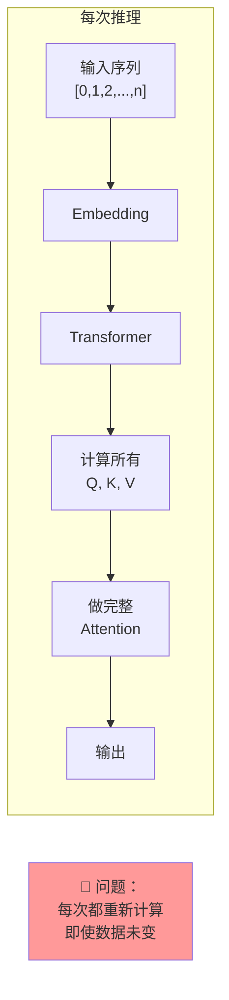

### **KV Cache 方式**

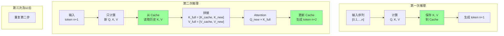

### **KV Cache 的存储位置对比**

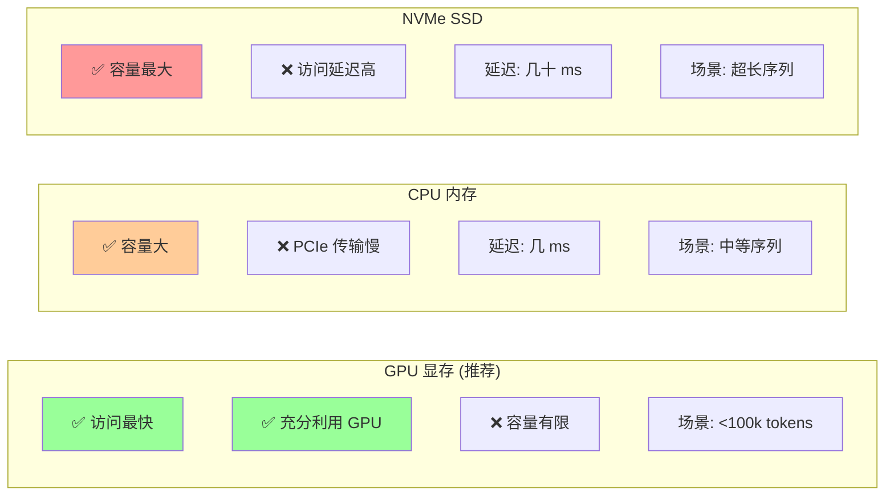

### **单次推理的显存使用时间线**

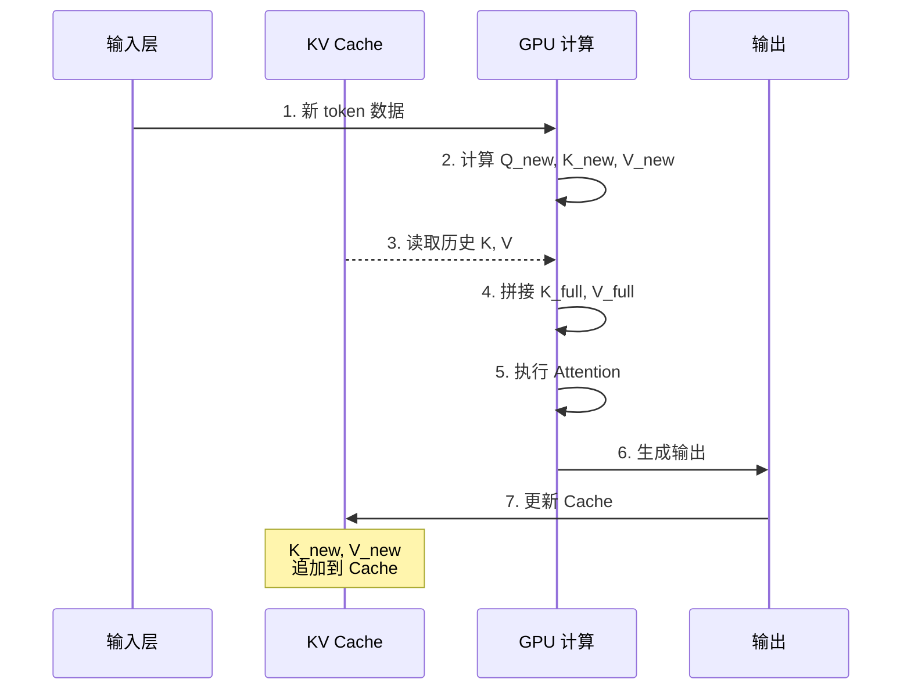

## 2. 大模型中的 KV Cache 实现

### **vLLM 的物理块管理流程**

```mermaid
graph TB
    subgraph "请求到达"
        A1["请求1<br/>序列长 500"]
        A2["请求2<br/>序列长 300"]
        A3["请求3<br/>序列长 200"]
    end
    
    subgraph "物理块分配"
        B1["块 1-32"]
        B2["块 33-51"]
        B3["块 52-63"]
    end
    
    subgraph "逻辑到物理映射"
        C1["请求1<br/>逻辑块: A,B,C,...]
        C2["请求2<br/>逻辑块: X,Y,...]
        C3["请求3<br/>逻辑块: P,Q,...]
    end
    
    subgraph "GPU 显存布局"
        D["物理块池<br/>├─ 块 1-32 (请求1)
        ├─ 块 33-51 (请求2)
        └─ 块 52-63 (请求3)"]
    end
    
    A1 --> B1
    A2 --> B2
    A3 --> B3
    
    B1 --> C1
    B2 --> C2
    B3 --> C3
    
    C1 --> D
    C2 --> D
    C3 --> D
    
    style D fill:#99ccff
```

### **单个请求的推理步骤**

```mermaid
graph LR
    subgraph "步骤 1: 初始化"
        S1["新 token 输入"]
        S1 --> S2["嵌入编码"]
    end
    
    subgraph "步骤 2: 逐层处理"
        S2 --> S3["Layer 1"]
        S3 --> L1A["计算 Q,K,V"]
        L1A --> L1B["第一层无 Cache<br/>计算完整 Attention"]
        L1B --> L1C["保存 K,V 到 Cache"]
        
        L1C --> S4["Layer 2"]
        S4 --> L2A["计算新 Q,K,V"]
        L2A --> L2B["从 Cache 读取<br/>历史 K,V"]
        L2B --> L2C["增量 Attention"]
        L2C --> L2D["更新 Cache"]
    end
    
    subgraph "步骤 3: 输出生成"
        L2D --> S5["输出层"]
        S5 --> S6["生成下一 token"]
    end
    
    style L1B fill:#ffcc99
    style L2C fill:#99ff99
```

### **HuggingFace 简单实现的 Cache 更新**

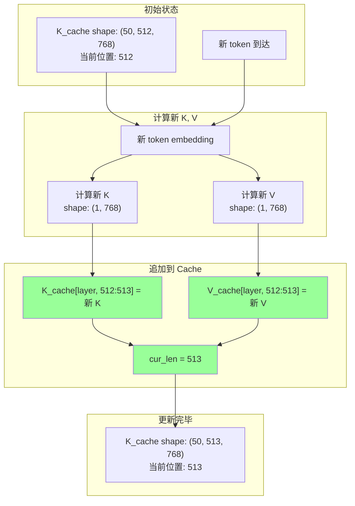

### **完整推理循环的数据流**

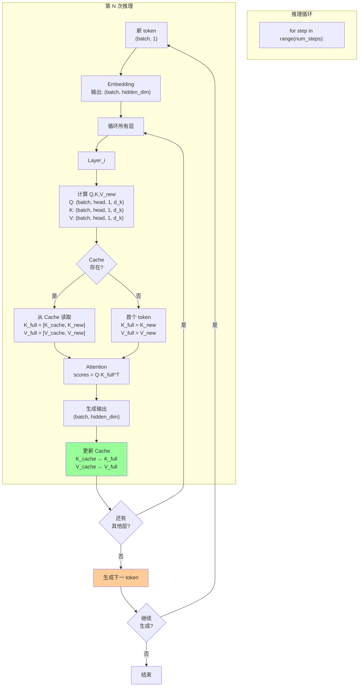

## 3. KV Cache 显存占用分析

### **显存占用公式推导流程**

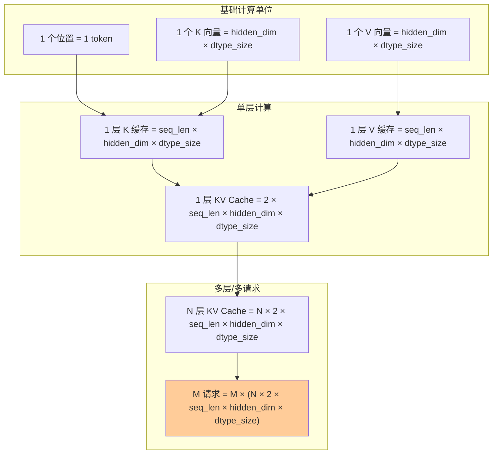

### **LLaMA 7B 模型的具体计算**

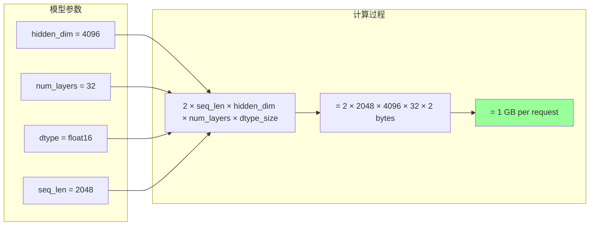

### **多请求共享的显存节省**

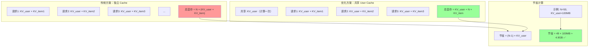

### **显存占用随序列长度变化**

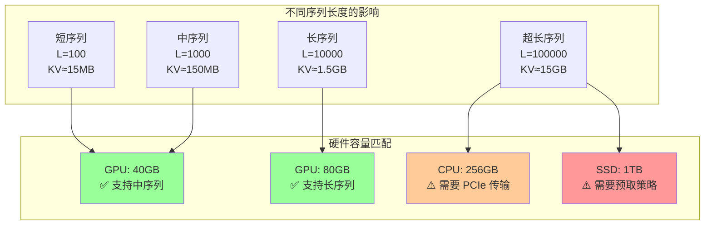

## 4. 关键指标

### **性能指标对比**

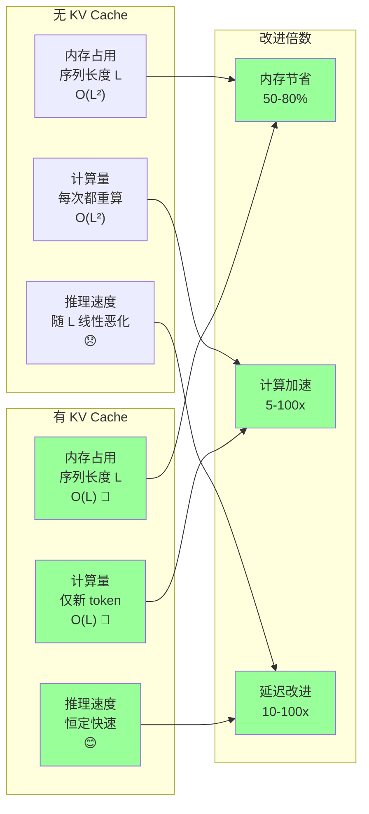

### **推理延迟对比**

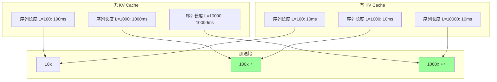

### **使用场景决策树**

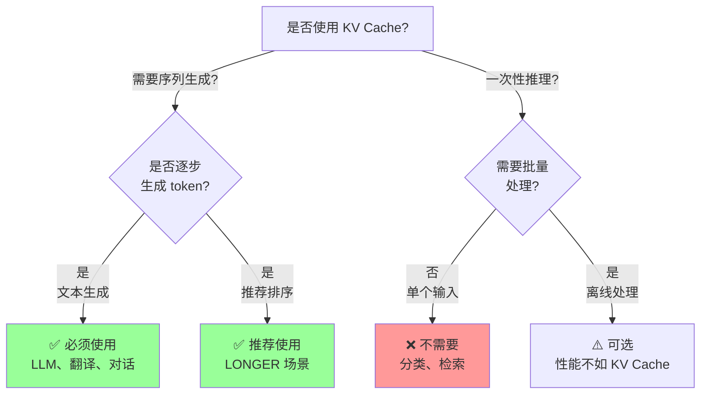

### **KV Cache 的权衡**

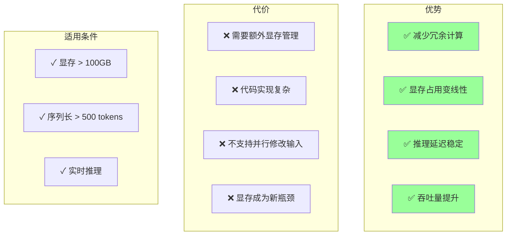

## 参考资源

详细的工程实现指南见：[kvcache_engineering.md](./kvcache_engineering.md)

相关技术文章：
- vLLM：https://github.com/lm-sys/vllm
- FlashAttention：https://github.com/HazyResearch/flash-attention
- HuggingFace Transformers：https://huggingface.co/docs/transformers/
