# KV Cache 原理详解

## 1. KV Cache 的存储和读取流程

### **传统方式（无 KV Cache）**


### **KV Cache 方式**


### **KV Cache 的存储位置对比**


### **单次推理的显存使用时间线**


## 2. 大模型中的 KV Cache 实现

### **vLLM 的物理块管理流程**

```mermaid
graph TB
    subgraph A["请求到达"]
        A1["请求1: 500 tokens"]
        A2["请求2: 300 tokens"]
        A3["请求3: 200 tokens"]
    end
    
    subgraph B["物理块分配"]
        B1["块 1-32"]
        B2["块 33-51"]
        B3["块 52-63"]
    end
    
    subgraph C["逻辑到物理映射"]
        C1["请求1: 逻辑块A,B,C"]
        C2["请求2: 逻辑块X,Y"]
        C3["请求3: 逻辑块P,Q"]
    end
    
    subgraph D["GPU 显存布局"]
        D1["块1-32: 请求1"]
        D2["块33-51: 请求2"]
        D3["块52-63: 请求3"]
    end
    
    A1 --> B1
    A2 --> B2
    A3 --> B3
    
    B1 --> C1
    B2 --> C2
    B3 --> C3
    
    C1 --> D1
    C2 --> D2
    C3 --> D3
    
    style D fill:#99ccff
    style D1 fill:#99ccff
    style D2 fill:#99ccff
    style D3 fill:#99ccff
```

### **单个请求的推理步骤**


### **HuggingFace 简单实现的 Cache 更新**

```mermaid
graph TB
    subgraph A["初始状态"]
        I1["K_cache shape: 50x512x768"]
        I2["当前位置: 512"]
        I3["新 token 到达"]
    end
    
    subgraph B["计算新 K, V"]
        P1["新 token embedding"]
        P2["计算新 K: shape 1x768"]
        P3["计算新 V: shape 1x768"]
    end
    
    subgraph C["追加到 Cache"]
        U1["K_cache[512:513] = 新K"]
        U2["V_cache[512:513] = 新V"]
        U3["cur_len = 513"]
    end
    
    subgraph D["更新完毕"]
        F1["K_cache shape: 50x513x768"]
        F2["当前位置: 513"]
    end
    
    I1 --> P1
    I2 --> P1
    I3 --> P1
    P1 --> P2
    P1 --> P3
    P2 --> U1
    P3 --> U2
    U1 --> U3
    U2 --> U3
    U3 --> F1
    U3 --> F2
    
    style U1 fill:#99ff99
    style U2 fill:#99ff99
    style U3 fill:#99ff99
    style F1 fill:#99ff99
    style F2 fill:#99ff99
```

### **完整推理循环的数据流**


## 3. KV Cache 显存占用分析

### **显存占用公式推导流程**

```mermaid
graph TB
    subgraph A["基础计算单位"]
        A1["1个位置 = 1个token"]
        A2["1个K向量 = hidden_dim x dtype_size"]
        A3["1个V向量 = hidden_dim x dtype_size"]
    end
    
    subgraph B["单层计算"]
        B1["1层K缓存 = seq_len x hidden_dim x dtype"]
        B2["1层V缓存 = seq_len x hidden_dim x dtype"]
        B3["1层KV = 2 x seq_len x hidden_dim x dtype"]
    end
    
    subgraph C["多层/多请求"]
        C1["N层KV = N x 2 x seq_len x hidden_dim x dtype"]
        C2["M请求 = M x N x 2 x seq_len x hidden_dim x dtype"]
    end
    
    A1 --> B1
    A2 --> B1
    A3 --> B2
    B1 --> B3
    B2 --> B3
    B3 --> C1
    C1 --> C2
    
    style C2 fill:#ffcc99
```

### **LLaMA 7B 模型的具体计算**

```mermaid
graph LR
    subgraph A["模型参数"]
        P1["hidden: 4096"]
        P2["layers: 32"]
        P3["dtype: fp16"]
        P4["seq_len: 2048"]
    end
    
    subgraph B["计算过程"]
        C1["2 x seq x hidden x layers x dtype"]
        C2["= 2 x 2048 x 4096 x 32 x 2bytes"]
        C3["= 1 GB per request"]
    end
    
    P1 --> C1
    P2 --> C1
    P3 --> C1
    P4 --> C1
    
    C1 --> C2
    C2 --> C3
    
    style C3 fill:#99ff99
```

### **多请求共享的显存节省**

```mermaid
graph TB
    subgraph A["传统方案"]
        T1["请求1: KV_user + KV_item1"]
        T2["请求2: KV_user + KV_item2"]
        T3["请求3: KV_user + KV_item3"]
        T_total["总 = N x KV_user + N x KV_item"]
    end
    
    subgraph B["优化方案"]
        O0["共享: KV_user"]
        O1["请求1: KV_user + KV_item1"]
        O2["请求2: KV_user + KV_item2"]
        O3["请求3: KV_user + KV_item3"]
        O_total["总 = KV_user + N x KV_item"]
    end
    
    subgraph C["节省计算"]
        S1["节省 = N-1 x KV_user"]
        S2["例: N=50, KV_user=100MB"]
        S3["节省 = 49 x 100MB = 4.9GB"]
    end
    
    T1 --> T_total
    T2 --> T_total
    T3 --> T_total
    
    O0 --> O1
    O0 --> O2
    O0 --> O3
    O1 --> O_total
    
    T_total --> S1
    O_total --> S1
    S2 --> S3
    
    style T_total fill:#ff9999
    style O_total fill:#99ff99
    style S3 fill:#99ff99
```

### **显存占用随序列长度变化**

```mermaid
graph TB
    subgraph A["不同序列长度"]
        L1["短: L=100, KV=15MB"]
        L2["中: L=1000, KV=150MB"]
        L3["长: L=10000, KV=1.5GB"]
        L4["超长: L=100k, KV=15GB"]
    end
    
    subgraph B["硬件容量匹配"]
        H1["GPU 40GB: 支持中序列"]
        H2["GPU 80GB: 支持长序列"]
        H3["CPU 256GB: 需PCIe传输"]
        H4["SSD 1TB: 需预取策略"]
    end
    
    L1 --> H1
    L2 --> H1
    L3 --> H2
    L4 --> H3
    L4 --> H4
    
    style H1 fill:#99ff99
    style H2 fill:#99ff99
    style H3 fill:#ffcc99
    style H4 fill:#ff9999
```

## 4. 关键指标

### **性能指标对比**

```mermaid
graph LR
    subgraph A["无 KV Cache"]
        N1["内存: O(L2)"]
        N2["计算: O(L2)"]
        N3["速度: 变慢"]
    end
    
    subgraph B["有 KV Cache"]
        Y1["内存: O(L)"]
        Y2["计算: O(L)"]
        Y3["速度: 恒快"]
    end
    
    subgraph C["改进倍数"]
        I1["内存节省 50-80%"]
        I2["计算加速 5-100x"]
        I3["延迟改进 10-100x"]
    end
    
    N1 --> I1
    Y1 --> I1
    N2 --> I2
    Y2 --> I2
    N3 --> I3
    Y3 --> I3
    
    style Y1 fill:#99ff99
    style Y2 fill:#99ff99
    style Y3 fill:#99ff99
    style I1 fill:#99ff99
    style I2 fill:#99ff99
    style I3 fill:#99ff99
```

### **推理延迟对比**

```mermaid
graph TB
    subgraph A["无 KV Cache"]
        T1["L=100: 100ms"]
        T2["L=1000: 1000ms"]
        T3["L=10000: 10000ms"]
    end
    
    subgraph B["有 KV Cache"]
        T4["L=100: 10ms"]
        T5["L=1000: 10ms"]
        T6["L=10000: 10ms"]
    end
    
    subgraph C["加速比"]
        S1["10x"]
        S2["100x"]
        S3["1000x"]
    end
    
    T1 --> S1
    T4 --> S1
    T2 --> S2
    T5 --> S2
    T3 --> S3
    T6 --> S3
    
    style S2 fill:#99ff99
    style S3 fill:#99ff99
```

### **使用场景决策树**

```mermaid
graph TB
    A["使用 KV Cache?"]
    
    A -->|需要逐步生成token| B{文本生成}
    
    B -->|是| C["✅ 必须使用"]
    
    A -->|一次性推理| E{离线批处理}
    
    E -->|是| F["❌ 不需要"]
    E -->|否| G["⚠️ 可选"]
    
    C --> C1["LLM对话"]
    C --> C2["翻译"]
    C --> C3["推荐排序"]
    
    F --> F1["分类任务"]
    G --> G1["检索任务"]
    
    style C fill:#99ff99
    style F fill:#ff9999
    style G fill:#ffcc99
```

### **KV Cache 的权衡**

```mermaid
graph TB
    subgraph A["优势"]
        P1["减少冗余计算"]
        P2["显存变线性"]
        P3["推理延迟稳定"]
        P4["吞吐量提升"]
    end
    
    subgraph B["代价"]
        N1["需额外显存管理"]
        N2["代码实现复杂"]
        N3["不支持并行修改"]
        N4["显存成为瓶颈"]
    end
    
    subgraph C["适用条件"]
        C1["显存 gt 100GB"]
        C2["序列 gt 500 tokens"]
        C3["实时推理"]
    end
    
    P1 --> C
    P2 --> C
    P3 --> C
    P4 --> C
    
    style P1 fill:#99ff99
    style P2 fill:#99ff99
    style P3 fill:#99ff99
    style P4 fill:#99ff99
```

## 参考资源

详细的工程实现指南见：[kvcache_engineering.md](./kvcache_engineering.md)

相关技术文章：
- vLLM：https://github.com/lm-sys/vllm
- FlashAttention：https://github.com/HazyResearch/flash-attention
- HuggingFace Transformers：https://huggingface.co/docs/transformers/
