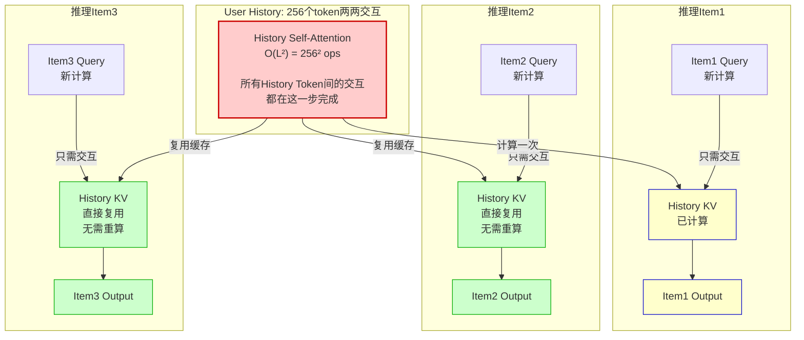

# 推荐系统中的KV Cache设计选择

## 问题引入

在推荐系统中，核心的推理任务是：**对同一个用户的多个候选Item进行排序推理**。

这引发了一个设计选择的问题：
- 是否应该**合并请求**，将多个Item组合成一个大请求进行一次推理？
- 还是**保持独立推理**，并通过KV Cache机制复用用户特征的计算结果？

> ~~这儿合并请求和kvcache可能并不是矛盾的~~

本文档系统地分析这两种方案的差异和权衡。

---

## 推荐系统排序阶段的现实流程

```
用户请求到达
    ↓
获取用户历史特征 (User Embedding, 历史行为序列等)
    ↓
召回阶段：获取候选Item池 (可能几百个)
    ↓
排序阶段：对每个Item做推理 ← ⚠️ 这是KV Cache的关键瓶颈
    ↓
返回Top-K结果给用户
```

在排序阶段，系统需要对**同一个用户**的**多个不同Item**进行CTR预测、相关性计分等推理任务。

---

## 方案对比：合并请求 vs 独立推理+Cache

### 方案1：直接合并请求

```
用户请求（伪代码）：
model_input = [
    user_history[:256],     # 用户历史序列
    item1_features[:50],    # Item1特征
    item2_features[:50],    # Item2特征
    item3_features[:50],    # Item3特征
    ...
    itemN_features[:50]     # ItemN特征
]

scores = model.forward(model_input)  # 一次推理得到所有Item的分数
```

**表面优势**：
- 一次forward pass获得N个Item的结果
- 理论上可以充分利用GPU的批处理能力

### 方案2：独立推理 + KV Cache

```
用户请求（伪代码）：
# 第1次推理
kv_user = model.encode_user_history(user_history[:256])
cache.save("user_kv", kv_user)

score1 = model.predict(kv_user, item1_features)

# 第2-N次推理
for item in items[1:]:
    kv_user = cache.load("user_kv")  # 直接加载，无需重新计算
    score = model.predict(kv_user, item_features)
```

**优势**：
- 复用用户历史的Attention计算结果
- 每次只需计算Item与缓存KV的交互

---

## 为什么不能直接合并？核心问题

### 问题1：计算重复浪费

在合并方案中，**User部分的Attention计算被重复执行**。

```
合并方案（批处理）：
[[User历史] + [Item1]] ──┐
[[User历史] + [Item2]] ──┼→ GPU batch 推理
[[User历史] + [Item3]] ──┘

每个批次中，User历史都需要重新计算：
- Batch 1: User → Item1，User部分计算一次
- Batch 2: User → Item2，User部分再计算一次  ← 重复！
- Batch 3: User → Item3，User部分再计算一次  ← 重复！

对于N个Item：
- User部分被计算 N 次
- 每次计算都是完全相同的结果
```

**计算量对比**：

```
假设：
- User历史序列长度 L = 256
- 单个Item特征维度 d = 50  
- 候选Item数 N = 100

合并方案的计算：
每个请求都需要：
  User Attention: O(L²) = O(256²) ≈ 65k ops
  Item @ User: O(d × L) ≈ 12.8k ops
  小计：~78k ops

100个Item：100 × 78k ≈ 7.8M ops

其中User Attention被计算了100次：
  100 × 65k = 6.5M ops （浪费！）


KV Cache方案的计算：
第1个Item：
  User Attention: O(L²) ≈ 65k ops
  Item @ User: O(d × L) ≈ 12.8k ops
  小计：~78k ops

后续99个Item（复用User KV）：
  Item @ User: O(d × L) ≈ 12.8k ops each
  小计：99 × 12.8k ≈ 1.27M ops

总计：78k + 1.27M ≈ 1.35M ops

节省：7.8M - 1.35M ≈ 6.45M ops
节省比例：(6.45M / 7.8M) × 100% ≈ 83%
```

### Self-Attention中History序列的两两计算复用

让我用一个视觉化的图表展示History序列内部的Self-Attention计算：



**关键洞察**：

```
User History中的Self-Attention计算（红色）：
  ├─ History内部256个token的两两交互 O(L²) = 65k ops
  ├─ 这个计算代价很高
  └─ 但对所有Item都是相同的！

对每个Item的推理（绿色/蓝色）：
  ├─ Item Query与缓存的History KV交互 O(d×L) = 13k ops
  ├─ 这个计算代价很低
  └─ 每个Item都需要一次

核心优势：
  History内部的O(L²)计算被一次性完成
  然后被复用N次，平均成本 = 65k / N + 13k
  而合并方案需要重复N次，成本 = 65k + 13k
```

**这是核心差异**：
- 合并方案：User计算被重复N次
- Cache方案：User计算只进行1次，后续复用

### 问题2：显存和流水线的实际约束

```
对于100个候选Item的推荐排序：

合并方案的显存需求：
- 需要一次性准备所有Item特征
- 如果Item特征获取有延迟，整个流程被阻塞
- 即使某些Item特征准备好，也要等其他Item

Cache方案的灵活性：
- Item可以逐个准备、逐个推理
- 一个Item推理完立即返回分数
- 无需等待其他Item
```

**实际流水线的差异**：

```
合并方案的执行流程（必须全部准备好才能推理）：
Item1特征准备 ──┐
Item2特征准备 ──┼→ 等所有Item准备好 ──→ 一次GPU推理 ──→ 返回所有分数
...           ├→ (某个Item慢，整个阻塞)
Item100特征准备 ┘

Cache方案的执行流程（逐个推理、逐个返回）：
Item1特征准备 ──→ GPU推理 ──→ 返回分数1
Item2特征准备 ──→ GPU推理（复用User KV） ──→ 返回分数2
Item3特征准备 ──→ GPU推理（复用User KV） ──→ 返回分数3
...
（可以并行处理其他用户的Item或后续排序步骤）
```

---

## 性能对比：定量分析

### 合并方案 vs Cache方案 的真实性能差异

**场景参数**：
- User历史序列长度：L = 256
- 单个Item特征维度：d = 50
- 候选Item数：N = 100

**合并方案**（每个Item都重新计算User部分）：

```
每个Item推理的成本：
  User Attention: O(L²) = 256² ≈ 65,536 ops
  Item与User交互: O(d×L) = 50×256 ≈ 12,800 ops
  单个 ≈ 78,336 ops

100个Item总成本：
  100 × 78,336 = 7,833,600 ops

其中User Attention的重复计算：
  100 × 65,536 = 6,553,600 ops (浪费)
```

**KV Cache方案**（User只计算一次）：

```
第1个Item：
  User Attention: O(L²) ≈ 65,536 ops
  Item与User交互: O(d×L) ≈ 12,800 ops
  小计 ≈ 78,336 ops

后续99个Item（复用User KV）：
  Item与User交互: O(d×L) ≈ 12,800 ops each
  99 × 12,800 = 1,267,200 ops

总成本：
  78,336 + 1,267,200 = 1,345,536 ops
```

**节省对比**：

```
节省的计算量 = 7,833,600 - 1,345,536 ≈ 6.5M ops
节省比例 = (6.5M / 7.8M) × 100% ≈ 83%

性能收益：
- 合并方案处理100个Item：需要全部User Attention计算
- Cache方案处理100个Item：User Attention只计算1次
- 相对加速：约 5.8 倍（理论值，实际因GPU批处理而异）
```

### 实际系统中的实现

**合并方案**（批处理10个Item）：

```
Batch 1 (Items 1-10):
  - 10个独立[User→Item]推理
  - User部分被计算10次 ≈ 650k ops
  - Item交互计算 ≈ 128k ops
  - Batch 1: 778k ops

Batch 2 (Items 11-20):
  - 10个独立[User→Item]推理
  - User部分再被计算10次 ≈ 650k ops (重复!)
  - Item交互计算 ≈ 128k ops
  - Batch 2: 778k ops

...

10个Batch总计：10 × 778k = 7.78M ops
```

**Cache方案**（批处理，共享User KV）：

```
第1个Batch (Items 1-10)：
  - 计算User KV一次 ≈ 65.5k ops
  - 10个Item的交互 ≈ 128k ops
  - Batch 1: 193.5k ops

后续9个Batch (Items 11-100)：
  - User KV直接加载（0 ops）
  - 10个Item的交互 ≈ 128k ops each
  - 每个Batch: 128k ops

10个Batch总计：193.5k + 9×128k = 1.35M ops
```

**性能提升倍数**：

```
7.78M ops / 1.35M ops ≈ 5.8 倍加速
```

---

## 为什么Cache方案更优？

### 1. 避免重复计算，5-6倍性能提升

```
核心优势：User部分只计算一次

合并方案：
- 每个Item推理都重新计算User Attention
- N个Item = N倍的User计算量

Cache方案：
- User Attention只计算1次
- 后续N-1个Item直接复用缓存KV
- 节省了(N-1)倍的User Attention计算

性能提升倍数 ≈ (User计算成本 × N) / (User计算成本 + Item交互成本×N)

具体例子：
- User Attention成本：65k ops
- Item交互成本：13k ops
- N = 100

合并方案：100 × (65k + 13k) = 7.8M ops
Cache方案：(65k + 13k) + 99 × 13k = 1.35M ops
加速倍数：7.8M / 1.35M ≈ 5.8 倍
```

这是Cache机制最核心、最直接的收益。

### 2. 流水线友好，无阻塞

```
Cache方案可以渐进式返回结果：

Item1特征准备完 ──→ GPU推理 ──→ 立即返回分数1
Item2特征准备完 ──→ GPU推理 ──→ 立即返回分数2
Item3特征准备完 ──→ GPU推理 ──→ 立即返回分数3

系统可以立即进行后续排序、过滤等操作，
无需等待所有Item都处理完成。

合并方案需要所有Item准备好才能一次推理，
如果某个Item特征获取较慢，会阻塞整个流程。
```

### 3. 工程集成简单

```
现有推荐系统的排序代码通常是循环形式：

def rank_items(user_id, candidate_items):
    user_features = get_user_features(user_id)
    scores = []
    for item in candidate_items:
        score = model.predict(user_features, item)
        scores.append(score)
    return sorted_by_score(scores)

集成Cache只需小改动：

def rank_items_with_cache(user_id, candidate_items):
    user_features = get_user_features(user_id)
    kv_user = model.encode_user(user_features)  # ← 新增
    cache.save(f"user_{user_id}", kv_user)       # ← 新增
    
    scores = []
    for item in candidate_items:
        kv_cached = cache.load(f"user_{user_id}") # ← 改动
        score = model.predict(kv_cached, item)    # ← 改动
        scores.append(score)
    return sorted_by_score(scores)

这与现有代码结构高度兼容。
```

### 4. 显存灵活性

```
Cache的KV可以灵活存储：

1. GPU显存（最快）
   - 活跃用户的KV保留在GPU
   
2. CPU内存（次快）
   - 用户历史较长或显存不足时转移到CPU
   
3. 磁盘/Redis（作为备选）
   - 支持极端情况下的缓存

合并方案没有这种灵活性，
必须一次性分配足够的显存。
```

---

## Target3有效性的重新思考

前面讨论中提到LONGER的Target3（跨用户共享）命中率有限。回过头来看：

```
Target2（同用户内Item间共享）：
✅ 100%命中，每个推理都能复用User KV
✅ 这已经足以为推荐系统带来显著收益

Target3（跨用户共享）：
⚠️ 在纯个性化推荐中，命中率很低（5-20%）
✅ 仅在热门内容场景中有效（榜单、标签等）

对于推荐系统来说：
- 即使只有Target2，就已经足够了
- Target3可以作为额外的优化，但不是必需
```

---

## 推荐系统中使用KV Cache的最佳实践

### 1. 明确缓存粒度

```
推荐系统中的缓存设计：

用户维度：
key = f"user_{user_id}"
value = {
    "kv_embeddings": computed_kv,
    "timestamp": time.now(),
    "ttl": 5分钟  # 用户历史可能变化，需要定期过期
}

多用户批处理：
key = f"user_{user_id}_batch_{batch_id}"
value = cached_kv
```

### 2. 缓存失效策略

```
缓存什么时候应该失效：

1. 时间过期（TTL）
   - 用户历史5分钟后可能有新交互
   - 需要重新计算KV

2. 用户历史更新
   - 用户点击、浏览了新商品
   - User KV Cache应该更新

3. 模型更新
   - 推荐模型版本更新
   - 旧的KV Cache不再适用
   - 需要全量清除

实现：
cache.invalidate_if(
    user_history_changed(user_id) or
    model_version_changed() or
    cache_ttl_expired()
)
```

### 3. 显存管理

```
由于推荐系统是长期运行的服务，显存会逐渐占满：

策略1：LRU淘汰
- 缓存最近使用过的用户KV
- 当显存满时，淘汰最久未使用的

策略2：热度感知
- 热用户（活跃、高价值）的KV保留在GPU显存
- 冷用户的KV转移到CPU内存

策略3：分层缓存
- GPU显存：最近100个活跃用户的KV (~1GB)
- CPU内存：最近1000个用户的KV (~10GB)
- 需要时从CPU加载到GPU

# 伪代码
if len(gpu_cache) > MAX_SIZE:
    if use_cpu_fallback:
        victim = lru_evict()
        move_to_cpu_cache(victim)
    else:
        victim = lru_evict()
        discard(victim)
```

---

## 总结：何时使用KV Cache

| 场景 | 建议 | 原因 |
|------|------|------|
| 推荐系统排序 | ✅ 使用 | 同用户多Item推理，Target2收益显著 |
| 离线推荐生成 | ❌ 不需要 | 批量处理，不关心实时延迟 |
| 个性化榜单 | ✅ 使用 | 多用户、多Item，Target2/3都有收益 |
| 实时CTR预测 | ✅ 使用 | 低延迟需求，Cache能显著优化 |
| 冷启动用户 | ❌ 不需要 | 用户历史短或为空，Cache收益有限 |
| 用户召回 | ❌ 不需要 | 单次查询，无需多个Item推理 |

---

## 思考题

1. 在你的推荐系统中，是否存在**显式的KV Cache管理机制**？还是每个Item推理都是独立的？

2. 用户历史序列的长度是多少？这直接影响Cache的收益：
   - 长序列 (L > 512)：Cache收益很大
   - 短序列 (L < 128)：Cache收益有限

3. 平均每个用户需要推理多少个Item？
   - N > 50：强烈建议使用Cache
   - N < 10：Cache可能收益有限

4. 推荐系统对推理延迟的容忍度？
   - < 100ms：必须使用Cache或合并
   - < 500ms：Cache有较大收益
   - > 1s：对Cache需求不紧迫

